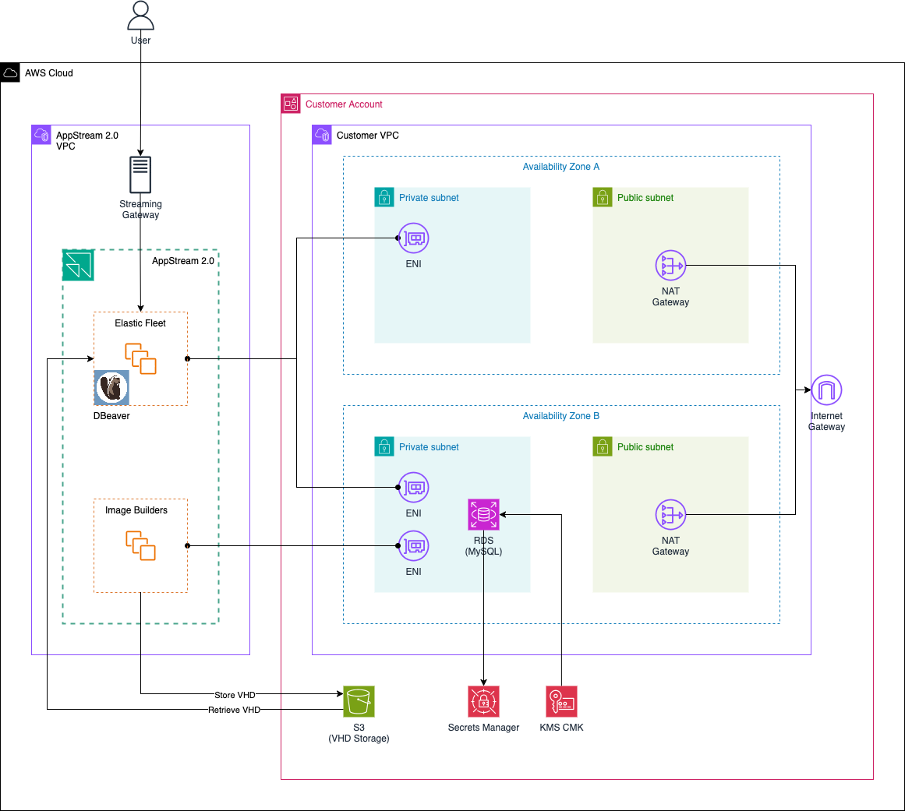

# Enable effortless and serverless App streaming using Amazon AppStream 2.0 Elastic Fleets

This is the repository for the official blog post [Enable effortless and serverless App streaming using Amazon AppStream 2.0 Elastic Fleets](https://www.hendrikhagen.com/blog/appstream-database-manager/).

# Architecture

Let’s begin by reviewing the architecture that will be deployed in this example. The high-level diagram below provides an overview of the key components involved. Our goal is to set up an AppStream 2.0 Elastic Fleet to stream the database management tool, DBeaver, to end users. This will allow them to manage an RDS MySQL database within a customer’s account. This setup is simply an example to demonstrate the functionality and potential of Amazon AppStream 2.0 Elastic Fleets.

The architecture consists of two main components. First, there is the customer VPC, which resides within the customer’s account. This VPC hosts the infrastructure that the AppStream application will interact with. In this example, we’ll be streaming the DBeaver application to manage an RDS MySQL database located within the customer’s VPC. Additionally, we’ll create an S3 bucket to store the VHD file and setup scripts required to deploy the AppStream application for Elastic Fleets.

The second component is the Amazon AppStream infrastructure, which will leverage Elastic Fleets. Elastic Fleets are a serverless fleet type that stream applications from an AWS-managed pool of streaming instances. This removes the need for administrators to predict usage, configure scaling policies, or manage images. Elastic Fleets are ideal for use cases with variable demand, such as software trials, training, sales demos, or converting desktop applications to a SaaS delivery model.

Applications in Elastic Fleets are stored as Virtual Hard Disks (VHD) in an S3 bucket. When a user launches an application, a new streaming instance is created, the VHD is downloaded, and the application is streamed to the user. This eliminates the need for manual scaling or image management, as AppStream 2.0 automatically handles the streaming instance pool.

In this scenario, we will launch an Image Builder instance to create the DBeaver VHD, which will then be uploaded to the S3 bucket. Next, we’ll configure an Elastic Fleet based on this DBeaver VHD. Users will then be able to connect to the Elastic Fleet and use the DBeaver application to manage the RDS database within the customer’s VPC via AppStream.

## Try it yourself

### Prerequisites

- [Terraform](https://developer.hashicorp.com/terraform/downloads)
- An AWS Account

### Setup

As this example includes manual configuration steps, please follow the step-by-step instructions of the original [blog post](https://www.hendrikhagen.com/blog/appstream-database-manager/).

### Teardown

Run `terraform destroy` to remove the infrastructure
