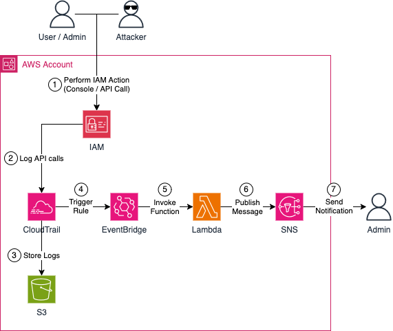

# Monitor Critical IAM Actions in AWS Using CloudTrail and SNS

This is the repository for the official blog post [Monitor Critical IAM Actions in AWS Using CloudTrail and SNS](https://www.hendrikhagen.com/blog/cloudtrail-alerting/).

# Architecture

Let’s begin by reviewing the demo infrastructure we’ll deploy as part of this blog post. The high-level diagram below outlines the key components involved in our setup. Our goal is to build a monitoring and notification pipeline for IAM API calls using CloudTrail, EventBridge, and SNS.



The infrastructure includes a CloudTrail trail, a logging S3 bucket, an EventBridge rule and trigger, a Lambda function, and an SNS topic for notifications. Here’s a step-by-step breakdown of how the workflow operates:

1. An IAM action is performed within the AWS account — this could be by a user, administrator, or potential attacker. The action might occur through the AWS Management Console or via programmatic API calls. Which specific actions to monitor can be defined during infrastructure setup.

2. CloudTrail records the IAM API call shortly after it happens.

3. CloudTrail stores log files at regular intervals in an S3 bucket. These logs are valuable for deeper investigation, compliance reporting, and audit purposes.

4. An EventBridge event is generated when the API call is logged by CloudTrail. An EventBridge rule captures relevant IAM events and triggers an associated target.

5. The EventBridge trigger invokes a Lambda function. This function processes the event, extracts key details, and composes a notification message for SNS.

6. The notification is sent to an SNS topic, which then distributes the message to all subscribed recipients — typically the cloud platform and security teams subscribed via their email addresses.

7. Recipients receive the notification and can take appropriate action based on the nature of the event, ensuring timely awareness and response to critical IAM activity within the AWS account.

## Try it yourself

### Prerequisites

- [Terraform](https://developer.hashicorp.com/terraform/downloads)
- An AWS Account

### Setup

Initialize and deploy the infrastructure by running:

```zsh
terraform init
terraform apply
```

Once the infrastructure has been deployed, you should receive an email from **cloudtrail-alerting no-reply@sns.amazonaws.com** with the subject **[EXTERNAL] AWS Notification - Subscription Confirmation**.

To start receiving notifications from the SNS topic, you’ll need to confirm your subscription. Open the email and click the **Confirm Subscription** link. This will take you to a confirmation page indicating that your subscription has been successfully confirmed.

The next step is to test the setup by logging into the AWS Console and creating, then deleting, an IAM user. If everything has been configured correctly, CloudTrail should capture both the **CreateUser** and **DeleteUser** API calls, and you should receive notifications via SNS.

### Teardown

Run `terraform destroy` to remove the infrastructure
