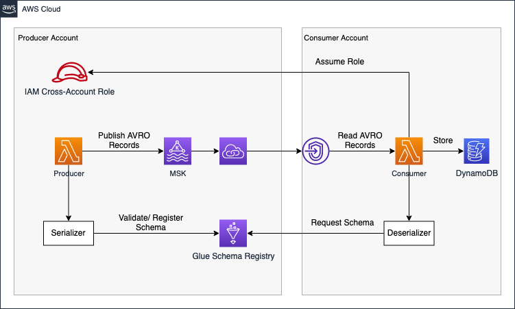
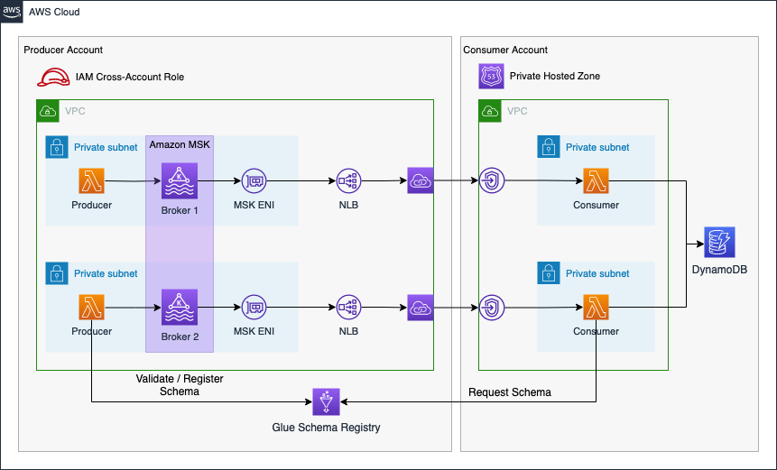

# Streamlined Kafka Schema Evolution in AWS using MSK and the Glue Schema Registry

This is the repository for the official blog post [Streamlined Kafka Schema Evolution in AWS using MSK and the Glue Schema Registry](https://www.hendrikhagen.com/blog/2023-12-23-kafka-schema-evolution/).

# Architecture

I would like to start by introducing the infrastructure that we are going to deploy as part of this blog post. The architecture diagram below provides a high-level snapshot of the components and workflow we are about to implement. Our objective is to build a cross-account streaming pipeline using AWS MSK and AWS VPC Endpoint Services.

The `Producer` Account houses the Amazon MSK Kafka Cluster and Kafka Lambda producers. To make our cluster available to the `Consumer` Account, we'll create a VPC Endpoint Service using Network Load Balancers and AWS Private Link. Leveraging Private Link allows us to expose our Kafka cluster as an internal AWS network service. In our simulated real-time workflow, event streaming data is created by Lambdas in the Producer Account and writing to a Kafka topic in the AVRO format. AVRO stores data definitions in JSON format alongside the data. This ensures easy readability and interpretation, with the actual data stored in a compact and efficient binary format.

In addition to the MSK cluster, we integrate the Glue Schema Registry into our workflow for schema evolution. The Lambda producers expect the payload as an event input and validate as well as register data schemas into the Schema Registry each time a message is written to a Kafka topic. The producer is configured to dynamically analyze the event data structure and register its schema during runtime. This means that the schema is derived dynamically from the input event, eliminating the need to define a JSON schema beforehand.

Beyond the Schema Registry, the Producer Account provides a cross-account IAM role, offering access to predefined parts of the Glue Schema Registry. This role can be assumed by entities needing schema access, enabling centralized schema management and permission control for consumers within the producer account.

Moving forward, once the Producer Account is established, we shift focus to the Consumer Account. Connecting to the VPC Endpoint Service of the Producer Account via VPC Endpoints ensures secure access to the Kafka Cluster from within the Consumer Account. To resolve Kafka broker domains, we create a Private Hosted Zone with records mapping Kafka broker domains to VPC Endpoint IPs. Subsequently, we set up AWS Lambda functions as Kafka consumers, utilizing Lambda Event Source Mapping for self-managed Kafka to reliably trigger functions whenever an event is written to the Kafka cluster by the producers.

Upon being triggered and receiving an AVRO payload, the Lambda assumes the cross-account IAM role in the producer account. Leveraging the assumed permissions, it requests the appropriate schema from the Glue Schema Registry. Once the schema is obtained, the consumer utilizes the information to deserialize the binary data, making it readable, and subsequently stores the deserialized payload into a DynamoDB table.

The architecture diagram below provides a more detailed overview of the system.

The connectivity pattern used for this example was highly inspired by the official AWS Big Data Blog Post [Secure connectivity patterns to access Amazon MSK across AWS Regions](https://aws.amazon.com/blogs/big-data/secure-connectivity-patterns-to-access-amazon-msk-across-aws-regions/). Please visit the original post to get a better understanding of the pattern employed and possible alternatives.

{}
This blog post will not delve into details regarding Kafka, AVRO, or schema evolution concepts in general. It is advisable to have a basic understanding of these concepts to fully grasp the architecture and workflow presented in the blog post.
{}

## Try it yourself

### Prerequisites

- [Terraform](https://developer.hashicorp.com/terraform/downloads)
- [Apache Maven](https://maven.apache.org/run.html)
- An AWS Account

### Setup

1. clone the repo
2. go into the folder `producer/code`
3. run the command `mvn package`
4. go into the folder `consumer/code`
5. run the command `mvn package`
6. go into the `producer`folder
7. Run `terraform init` to initialize the Terraform environment
8. Run `terraform plan` and `terraform apply` to deploy the infrastructure
9. go into the `consumer`folder once the producer has been deployed successfully
10. Run `terraform init` to initialize the Terraform environment
11. Run `terraform plan` and `terraform apply` to deploy the infrastructure

### Result

Terraform will deploy the MSK Kafka streaming pipeline.

### Teardown

Run `terraform destroy` to remove the infrastructure
