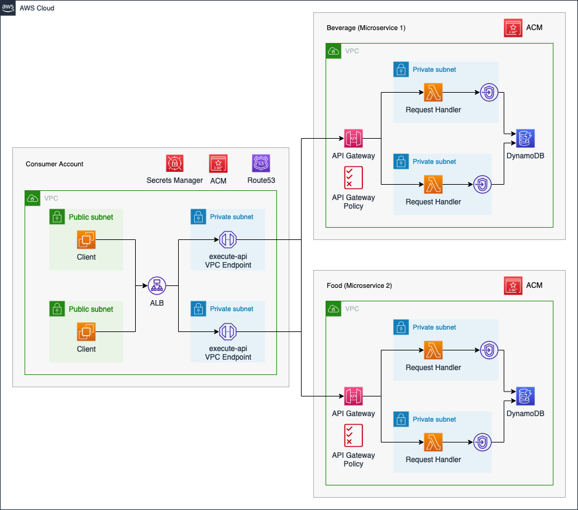
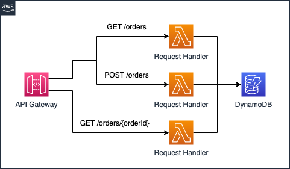

# Serverless Cross-Account Microservices

This is the repository for the official blog post [Serverless Cross-Account Microservices](https://www.hendrikhagen.com/blog/2023-06-23-cross-account-microservices/).

# Architecture

As an introduction, I would like to guide you through the infrastructure that we will set up as part of this blog post. The diagram below displays the target architecture that we will build and deploy.

We will deploy a microservice architecture consisting of one `Consumer Account` and two microservices - `Beverage` and `Food`. The microservices can be used by internal clients to order beverages and food. We will use distinct AWS Accounts for both microservices as well as the Consumer Account.

The Consumer Account will serve as a central hub from which the microservices can be consumed. The clients will communicate with each service via an internal Application Load Balancer. We will employ an internal ALB to make sure that only local VPC clients are able to communicate with our microservices. The ALB will forward the traffic to a VPC Endpoint which is connected to the API Gateway Service `execute-api`.

By leveraging VPC Endpoints, we are able to communicate with the private API Gateways located in the microservice accounts via the internal AWS network. We will set up a private Hosted Zone in Route53 as well as an Alias record for each microservice. This will allow the clients to utilize readable domains when sending requests to the corresponding microservice. To ensure secure connections, we will utilize HTTPS listeners in combination with our ALB. The certificate will be provided via AWS Certificate Manager, ACM. Lastly, we will set up a secret in Secrets Manager to store the ID of the VPC Endpoint. We will share this secret with the microservice accounts to allow them to dynamically retrieve the VPC Endpoint ID and define API Gateway policies to allow traffic from the Consumer Account.

The microservices used as part of this example are meant to serve as a template and are simple in nature. We will set up a private API Gateway with multiple resources and methods. These resources and methods will allow clients to order beverages and food as well as look up past orders. As the goal is to build a serverless microservice architecture, we will use AWS Lambda in the API Gateway Integration Methods and DynamoDB for storage. The Lambda functions will store orders and retrieve data from a DynamoDB table.

To ensure secure and private communication between DynamoDB and AWS Lambda, we will place our Lambda functions inside the VPC and utilize a DynamoDB VPC Endpoint of type `Gateway`. Lastly, we will define a custom domain for the API Gateways. These domains will match the Alias records defined in the Consumer Account to ensure that connections can be initiated successfully between the Consumer account and the microservices. The certificate needed to define custom domains for the API Gateway will be provided by ACM.

The following diagram will give you a quick overview of the API Gateway resources and methods that are available for each microservice. Both the `Food` and `Beverage` microservice will be set up identically.

We will set up each microservice with one main resource `orders`. The resource `orders` will have a `GET` and a `POST` method. The GET method can be used to retrieve all orders that were already issued while the POST method is used to create new orders. Once an order has been created, it can be retrieved individually via `orderId` and the GET-method of the subresource `orders/{orderId}`.

## Try it yourself

### Prerequisites

- [Terraform](https://developer.hashicorp.com/terraform/downloads)
- An AWS Account

### Setup

1. Clone the repo
2. go into the `consumer`folder
3. Adjust the Terraform variable `allowed_service_principal_arns`
4. Run `terraform init` to initialize the Terraform environment
5. Run `terraform plan` and `terraform apply` to deploy the infrastructure
6. go into the `microservices`folder once the consumer has been deployed successfully
7. Run `terraform init` to initialize the Terraform environment
8. Run `terraform plan` and `terraform apply` to deploy the infrastructure

### Result

Terraform will deploy a cross-account/cross-vpc microservice architecture.

### Teardown

Run `terraform destroy` in the folder `consumer` and `microservices` to remove the infrastructure
