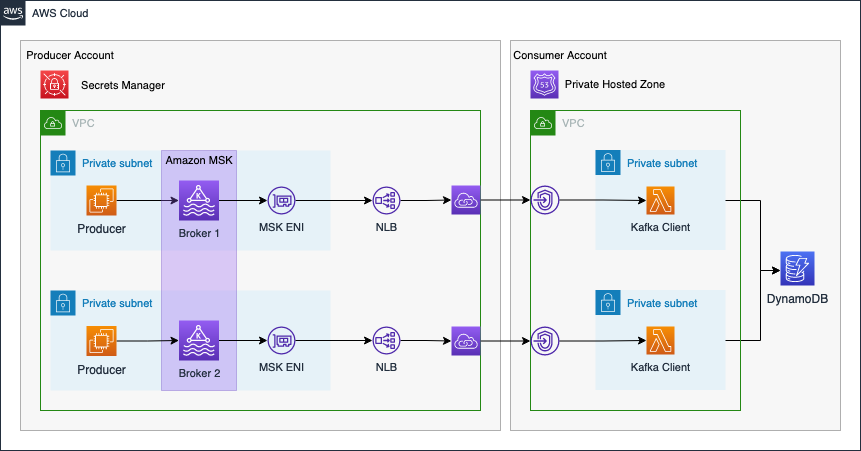

# Cross Account Kafka Streaming

This is the repository for the official tecRacer two-part blog series.

Part 1: [Cross Account Kafka Streaming: Part 1](https://www.tecracer.com/blog/2023/05/cross-account-kafka-streaming-part-1.html).

Part 2: [Cross Account Kafka Streaming: Part 2](https://www.tecracer.com/blog/2023/05/cross-account-kafka-streaming-part-2.html).

# Architecture

As an introduction, I would like to guide you through the infrastructure that we will set up as part of this blog post. The diagram below displays the target architecture that we will build and deploy.

We will set up a cross-account streaming pipeline using `Amazon MSK` and `AWS Lambda`. We will use two distinct AWS accounts. The first account will be the `Producer Account` and the second account will be the `Consumer Account`.

The Producer Account will contain the Amazon MSK Kafka Cluster as well as the Kafka producer hosted on EC2 instances. To make Kafka available to the Consumer Account, we will set up a VPC Endpoint Service using Network Load Balancers and AWS Private Link. By using Private Link we will be able to expose our Kafka cluster as a service via the internal AWS network. We will also create a secret in AWS Secrets Manager in order to store connection information of the Kafka cluster and Private Link service. This secret will be shared with the Consumer Account. To simulate a real-time analytics workflow, event streaming data will be produced by EC2 instances in the Producer Account and written to a Kafka topic. We will simulate temperature sensors in our example.

Once the Producer Account has been set up, we will continue with the Consumer Account. The Consumer Account will connect to the VPC Endpoint Service of the Producer Account via VPC Endpoints. This will allow the Kafka client in the Consumer Account to reach the Kafka Cluster securely. To be able to resolve the Kafka broker domains, we will also create a Private Hosted Zone with records that will map the Kafka broker domains to the VPC Endpoint IPs. Afterward, we will set up AWS Lambda functions as Kafka consumers. The Lambda Event Source Mapping for self-managed Kafka can be used to reliably trigger our Lambda functions each time an event is written to the Kafka cluster. To simulate a real-time analytics workflow, the Lambda functions will consume the Kafka topic, aggregate the data and store the results in a DynamoDB table.

The connectivity pattern used for this example was highly inspired by the official AWS Big Data Blog Post [Secure connectivity patterns to access Amazon MSK across AWS Regions](https://aws.amazon.com/blogs/big-data/secure-connectivity-patterns-to-access-amazon-msk-across-aws-regions/). Please visit the original post to get a better understanding of the pattern employed and possible alternatives.

## Try it yourself

### Prerequisites

- [Terraform](https://developer.hashicorp.com/terraform/downloads)
- An AWS Account

### Setup

1. Clone the repo
2. go into the `producer`folder
3. Run `terraform init` to initialize the Terraform environment
4. Run `terraform plan` and `terraform apply` to deploy the infrastructure
5. go into the `consumer`folder once the producer has been deployed successfully
6. Run `terraform init` to initialize the Terraform environment
7. Run `terraform plan` and `terraform apply` to deploy the infrastructure

### Result

Terraform will deploy a cross-account/cross-vpc MSK Kafka streaming pipeline.

### Teardown

Run `terraform destroy` to remove the infrastructure
