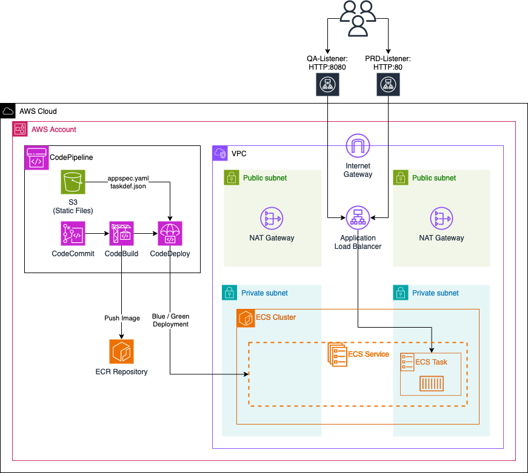
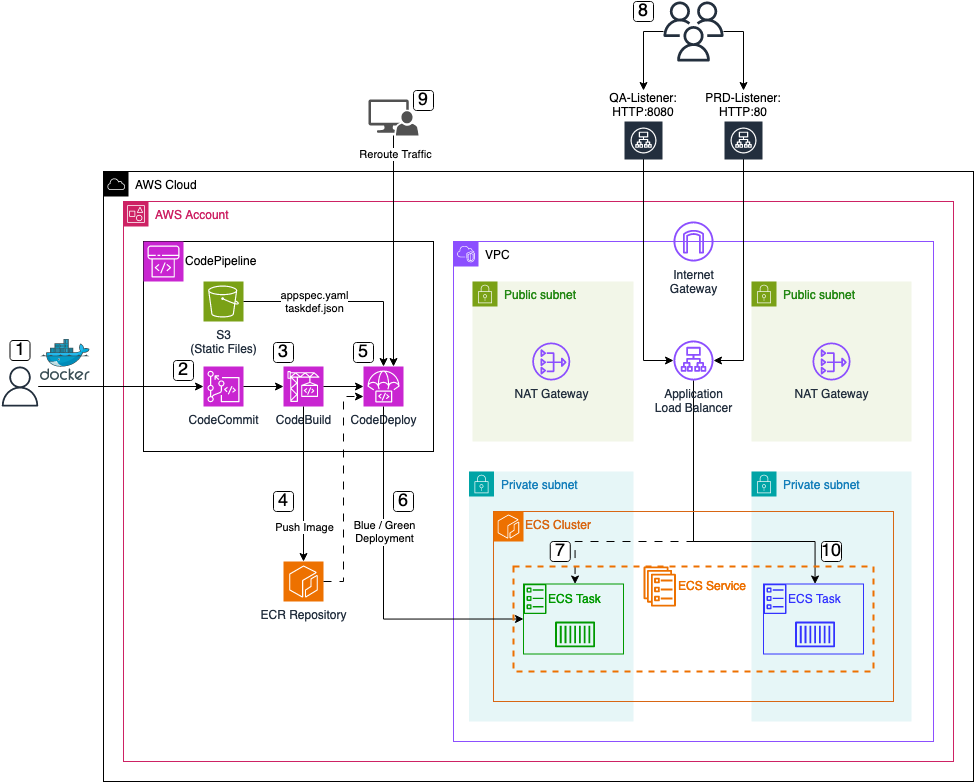

# Automated ECS deployments using AWS CodePipeline

This is the repository for the official blog post [Automated ECS deployments using AWS CodePipeline](https://www.hendrikhagen.com/blog/2024-03-27-ecs-deployment-pipeline/).

# Architecture

To begin, let's delve into the architecture we intend to deploy for this example. The diagram below provides a high-level overview of the setup we aim to simulate. Our primary objective here is to establish a CI/CD pipeline utilizing AWS CodePipeline. This pipeline will automate the processes of building, testing, and deploying Docker images to an ECS cluster hosted within the AWS Cloud.

We'll configure a VPC with two private and two public subnets. Our ECS cluster will reside in the private subnets, while each public subnet will host a NAT gateway. These gateways will enable ECS tasks to communicate with AWS services or the public Internet.

Next, we'll implement an ECS service with a single ECS task initially running a simple Apache web server. This ECS task will be made accessible through an Application Load Balancer (ALB). The ALB will have two Target Groups and two Listeners:

- **PRD-Listener**: Listens on port HTTP:80 for normal production traffic. It forwards this traffic to the `primary` Target Group, directing it towards the ECS task currently running.

- **QA-Listener**: Listens on port HTTP:8080 for test traffic (used for Blue/Green deployment). This traffic is forwarded to the `secondary` Target Group, which initially won't contain any ECS tasks.

For automated deployments of new application versions, we'll utilize AWS CodePipeline. This pipeline will include:

- **CodeCommit Repository**: Used by developers for application development, including a Dockerfile.

- **S3 Bucket**: Contains two static files, appspec.yaml and taskdef.json, required by the CodeDeploy step for Blue/Green deployment.

- **CodeBuild Step**: Utilizes the provided Dockerfile to build a new Docker image of the application. This image is then pushed to an Amazon ECR repository.

- **CodeDeploy Step**: Utilizes the static files along with the new Docker image from the ECR repository to perform a Blue/Green deployment.

This setup enables automated building, testing, and deploying of Docker images to the ECS cluster, streamlining the development and deployment processes.

# Pipeline Workflow

Now, let's delve into the overarching workflow when employing the ECS pipeline to deploy new application versions.

1. **Application Preparation**: The process kicks off with the creation of a `Dockerfile` along with all necessary application files.

2. **CodeCommit Repository Update**: Upon completion of the new application version, developers push the code and files into the AWS CodeCommit repository. This action serves as the trigger for the AWS CodePipeline execution.

3. **Build Stage Execution**: Following the trigger, the CodeBuild step initiates the building of a new `Docker` image using the committed Dockerfile.

4. **Image Storage in ECR**: Once the image is built, it is pushed into an AWS ECR repository for future utilization.

5. **CodeDeploy Step Initiation**: Subsequently, the CodeDeploy step starts, utilizing the newly build Docker image from the ECR repository along with two essential static files, namely `appspec.yaml` and `taskdef.json`, retrieved from the S3 bucket.

6. **Blue/Green Deployment Initialization**: Facilitated by the CodeDeploy step, a Blue/Green deployment is initiated. This entails launching a new task within the ECS Service, using the freshly generated Docker image as its foundation.

7. **Task Registration in Secondary Target Group**: Upon task launch, it is registered within the previously mentioned `secondary` Target Group of the Application Load Balancer (ALB). This configuration enables test traffic from the `QA-Listener` on `HTTP:8080` to be directed to the new application version.

8. **Testing Phase**: With the task successfully registered, users, developers, or administrators gain access to the new application version via the `QA-Listener` on `HTTP:8080`. This facilitates comprehensive testing of the new version and its features before transitioning to production.

9. **Traffic Rerouting**: Upon successful testing, administrators trigger traffic rerouting within the CodeDeploy step. This action adjusts the rules of the `PRD-Listener`, redirecting traffic to the current `secondary` Target Group. Consequently, the `secondary` Target Group assumes the role of the new `primary` Target Group, allowing users to access the new application version via the `PRD-Listener` on `HTTP:80`. The previous application version becomes inaccessible at this point.

10. **Finalization of Deployment**: To conclude the deployment process, the old application task is terminated, ensuring a seamless transition to the new version.

## Try it yourself

### Prerequisites

- [Terraform](https://developer.hashicorp.com/terraform/downloads)
- An AWS Account

### Setup

1. clone the repo
2. Run `terraform init` to initialize the Terraform environment
3. Run `terraform plan` and `terraform apply` to deploy the infrastructure

### Result

Terraform will deploy the ECS deployment pipeline.

### Teardown

Run `terraform destroy` to remove the infrastructure
