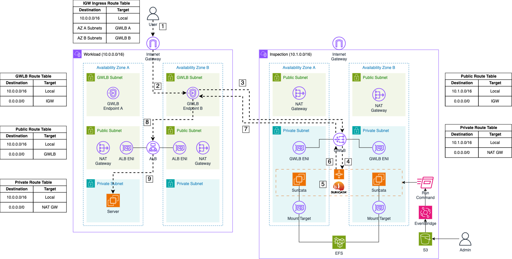
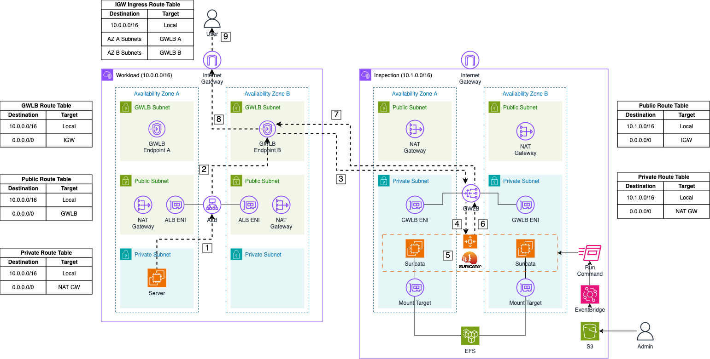

# Build a scalable IDS and IPS solution using Suricata and AWS Gateway Load Balancer

This is the repository for the official blog post [Build a scalable IDS and IPS solution using Suricata and AWS Gateway Load Balancer](https://www.hendrikhagen.com/blog/2024-05-21-gwlb-appliance/).

# Architecture

To begin, let's delve into the architecture we intend to deploy for this example. The diagram below provides a high-level overview of the setup we aim to simulate. Our primary objective is to build a highly available, scalable, and cost-effective IDS/IPS solution in AWS using Suricata and the AWS Gateway Load Balancer.

The architecture consists of two VPCs: the `Workload` VPC and the `Inspection` VPC. The `Inspection` VPC will house the Suricata appliance and the Gateway Load Balancer. This VPC is divided into two subnet categories: `Public` and `Private` subnets. Each public subnet will contain a NAT Gateway to provide Internet access, which is necessary for bootstrapping the Suricata instances and downloading the latest signatures from open-source databases. The Suricata appliance will be placed in an AWS Auto Scaling group to enable automatic scaling based on traffic load, allowing for the deployment of additional Suricata instances as needed. These instances will be attached to an Elastic File System (EFS) for durable and highly available storage of logs and important files.

Additionally, an S3 bucket and an AWS EventBridge rule will be implemented to manage custom Suricata rules post-launch. Rule files can be uploaded to the S3 bucket and weill be synchronized across all instances in the Auto Scaling group using Systems Manager Run Commands, triggered by EventBridge rules.

The Auto Scaling group sits behind an AWS Gateway Load Balancer, which distributes traffic to the instances within the group. The Gateway Load Balancer receives traffic through a Gateway Load Balancer Endpoint, with traffic between them encapsulated using GENEVE to ensure packets arrive unchanged at the appliance level.

In this setup, traffic originates from the `Workload` VPC, which is divided into three subnet categories: `GLWB`, `Public`, and `Private` subnets. The GLWB subnets contain the Gateway Load Balancer Endpoints connected to the Gateway Load Balancer in the Inspection VPC. When traffic arrives at the Internet Gateway of the Workload VPC, it is routed to the GLWB Endpoints via an Ingress Routing Table attached to the Internet Gateway. The public subnets house the NAT Gateway to facilitate Internet access from the private subnets and the Application Load Balancer, which receives user requests and forwards them to the servers located in the private subnets.

## Traffic Flow

### Ingress Traffic Flow

Now, let's delve into the ingress traffic flow when using our Suricata setup with a Gateway Load Balancer.

1. **Request**: The user sends a request to the DNS name of our Application Load Balancer to access our web server. The request first reaches the Internet Gateway of our VPC.

2. **Forward to GWLB Endpoint**: The packet is routed to the appropriate Gateway Load Balancer (GWLB) Endpoint based on the entries in the Internet Gateway ingress routing table.

3. **Forward to GWLB**: The GWLB Endpoint receives the request, encapsulates the packet with GENEVE, and forwards it to the GWLB in the Inspection VPC.

4. **Send to Appliance**: The GWLB forwards the encapsulated packet to its target group, which includes the Suricata instances registered by the Auto Scaling Group.

5. **Monitor Traffic**: Once the packet arrives at a Suricata instance, the GENEVE protocol is temporarily stripped by Suricata, allowing the initial traffic to be monitored and logged using Suricata's IDS and IPS capabilities.

6. **Forward monitored Traffic**: If the traffic is not blocked due to malicious activity, Suricata returns the GENEVE packet to the GWLB.

7. **Return to GWLB Endpoint**: The GWLB returns the inspected traffic to the Endpoint that initially sent the packet.

8. **Forward to ALB**: The GWLB Endpoint receives the inspected traffic and forwards it based on the subnet's routing table. In this case, the packet is addressed to the private IP of the Application Load Balancer.

9. **Forward to Server**: The Application Load Balancer receives the initial request and forwards it to the web server.

### Egress Traffic Flow

After describing the ingress traffic flow, let's examine the egress traffic flow.

1. **Response**: After processing the user's request, the web server sends a response back to the user. This response first goes to the Application Load Balancer (ALB).

2. **Forward to GWLB Endpoint**: The ALB routes the packet to the appropriate Gateway Load Balancer (GWLB) Endpoint based on the routing table entries of the public subnets where the ALB is located.

3. **Forward to GWLB**: The GWLB Endpoint receives the packet, encapsulates it with GENEVE, and forwards it to the GWLB in the Inspection VPC.

4. **Send to Appliance**: The GWLB then forwards the encapsulated packet to its target group, which includes the Suricata instances managed by the Auto Scaling Group.

5. **Monitor Traffic**: Upon arrival at a Suricata instance, the GENEVE protocol is temporarily stripped, allowing Suricata to monitor and log the traffic using its IDS and IPS capabilities.

6. **Forward monitored Traffic**: If the traffic is not blocked due to malicious activity, Suricata re-encapsulates the packet with GENEVE and returns it to the GWLB.

7. **Return to GWLB Endpoint**: The GWLB sends the inspected traffic back to the Endpoint that originally forwarded the packet.

8. **Forward to Internet Gateway**: The GWLB Endpoint receives the inspected traffic and forwards it to the Internet Gateway of the VPC.

9. **Return to User**: The response is then delivered to the user.

## Try it yourself

### Prerequisites

- [Terraform](https://developer.hashicorp.com/terraform/downloads)
- An AWS Account

### Setup

1. clone the repo
2. Navigate to the `inspection` folder 
3. Change the Terraform variable `allowed_service_principal_arns`
4. Run `terraform init` to initialize the Terraform environment
5. Run `terraform plan` and `terraform apply` to deploy the infrastructure
6. Navigate to the `workload` folder
7. Run `terraform init` to initialize the Terraform environment
8. Run `terraform plan` and `terraform apply` to deploy the infrastructure

### Result

Terraform will deploy the Suricata IDS/IPS setup.

### Teardown

Run `terraform destroy` to remove the infrastructure
