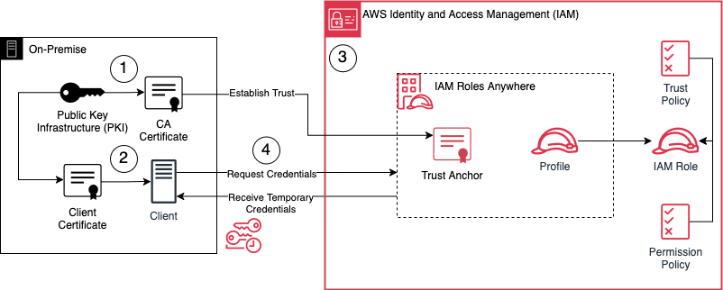

# Using IAM Roles Anywhere to Eliminate Static AWS Credentials

This is the repository for the official blog post [Using IAM Roles Anywhere to Eliminate Static AWS Credentials](https://www.hendrikhagen.com/blog/iam-roles-anywhere/).

# Workflow

Before diving into the hands-on walkthrough, let’s first take a look at the infrastructure we’ll be setting up to demonstrate the functionality of AWS IAM Roles Anywhere. The diagram below outlines both the architecture and the steps we'll follow throughout this guide.

1. **Set up a Public Key Infrastructure (PKI) using OpenSSL** - We’ll generate a private key and a certificate for our Certificate Authority (CA). This CA certificate will later serve as the trust anchor in IAM Roles Anywhere and will be used to sign the client certificate.

2. **Generate a client certificate** - This certificate, signed by the CA, will be used by our external workload to request temporary credentials from IAM Roles Anywhere.

3. **Configure IAM Roles Anywhere** - With the PKI in place, we’ll register the CA certificate as a Trust Anchor in IAM Roles Anywhere. We’ll also create a Profile, which specifies the IAM roles that can be assumed and what actions the temporary credentials allow.

4. **Request and test temporary credentials** - Finally, we’ll use the client certificate to request temporary AWS credentials via IAM Roles Anywhere. With those credentials, we’ll perform a few AWS API calls to validate everything is working as expected.

## Try it yourself

### Prerequisites

- [Terraform](https://developer.hashicorp.com/terraform/downloads)
- An AWS Account

### Setup

As this example includes manual configuration steps, please follow the step-by-step instructions of the original [blog post](https://www.hendrikhagen.com/blog/iam-roles-anywhere/).

### Teardown

Run `terraform destroy` to remove the infrastructure