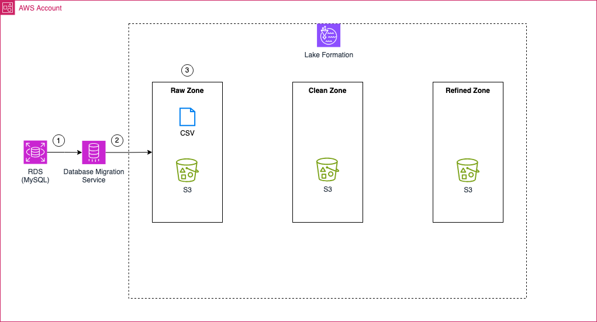
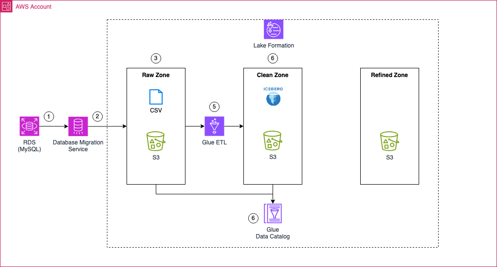
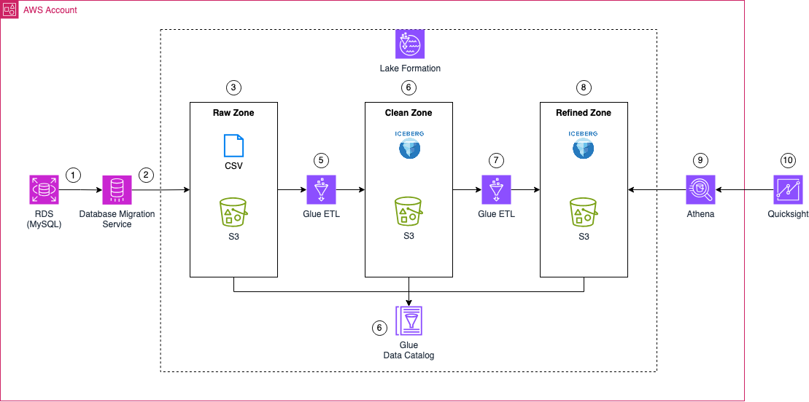

# Building a transactional data lake using Lake Formation and Apache Iceberg

This blog post is the first in a three-part series on building a transactional Data Lake using AWS LakeFormation and Apache Iceberg.

- **Part 1**: ["Building a transactional data lake using Lake Formation and Apache Iceberg Part 1"](https://www.hendrikhagen.com/blog/2025-02-17-transactional-iceberg-data-lake-1/) - We’ll lay the foundation by setting up the Data Lake using AWS LakeFormation and ingesting data from a sample source database with AWS Database Migration Service (DMS).

- **Part 2**: ["Building a transactional data lake using Lake Formation and Apache Iceberg Part 2"](https://www.hendrikhagen.com/blog/2025-02-17-transactional-iceberg-data-lake-2/) – We’ll expand the Data Lake by setting up ELT pipelines with AWS Glue. These jobs will clean and transform the raw ingested data into Iceberg tables, making it ready for downstream analytics.

- **Part 3**: ["Building a transactional data lake using Lake Formation and Apache Iceberg Part 3"](https://www.hendrikhagen.com/blog/2025-02-17-transactional-iceberg-data-lake-3/) – We’ll complete the series by integrating a Business Intelligence (BI) workload. This includes consolidating data stored in Iceberg tables and using it as the foundation for a QuickSight dashboard for visualization and insights.

## Part 1: Ingestion Architecture 

Part 1 focuses on implementing the ingestion layer of our Data Lake. Our goal is to set up a fully functional AWS DMS pipeline that ingests data from a MySQL database into the Raw Zone of our Data Lake using either full load or change data capture (CDC).

To achieve this, we will first create an RDS MySQL database that serves as our data source. We will set up multiple tables in this database and populate them with sample data. Once the source database is ready, we will configure a serverless AWS DMS job to migrate data from MySQL to an S3 bucket dedicated to the Raw Zone. The DMS pipeline will begin with a full load of all existing data and then enable Change Data Capture (CDC) to continuously replicate changes from the source database to S3. The output format for all data ingested via DMS will be CSV.

Once ingested, the raw data will reside in the Raw Zone S3 bucket, containing both the initial full load and all subsequent changes captured through CDC. This raw data will serve as the foundation for the next phase, where AWS Glue ETL jobs will transform the CSV files into Apache Iceberg tables, making them ready for further processing and analytics.

By the end, we will have a fully operational data ingestion pipeline that continuously replicates changes from MySQL into our Data Lake, setting the stage for data transformation and analytics in the next part of this series.

## Part 2: ETL Jobs

The focus of part 2 is to define AWS Glue ETL jobs that will transform the raw data into Apache Iceberg tables—tables that are optimized for downstream workflows and high-performance analytics.

To achieve this, we’ll begin by creating multiple AWS Glue ETL jobs that will process the AWS DMS full load files as well as the change data capture (CDC) files. These jobs will be responsible for creating the initial Apache Iceberg tables and for making any adjustments as new data flows into the system.

Metadata for the Apache Iceberg tables, as well as data in the raw zone S3 bucket, will be managed and stored in the AWS Glue Data Catalog. This catalog serves as the metadata repository that keeps track of the structure and properties of the tables, making it easier to manage and query the data.

Once the transformation is complete, the clean zone S3 bucket will house the Apache Iceberg files. These tables will serve as the foundation for further data processing and analytics workloads.

## Part 3: Business Intelligence Workloads

The goal of part 3 is to enhance our existing Data Lake by introducing Business Intelligence capabilities and a consolidated data layer.

To achieve this, we’ll first create a Glue ETL job that processes data from the clean zone, consolidating it into a unified view before storing the results in an Apache Iceberg table within the refined zone. This refined zone acts as the foundation for our Business Intelligence workloads, making it easier to access and analyze data efficiently.

From there, the consolidated data will be accessed by Amazon QuickSight via an Athena data connection. QuickSight will allow us to visualize the refined data, making analysis more intuitive and helping us extract meaningful insights.

## Try it yourself

### Prerequisites

- [Terraform](https://developer.hashicorp.com/terraform/downloads)
- An AWS Account

### Setup

As this example includes manual configuration steps, please follow the step-by-step instructions of the original [blog post](https://www.hendrikhagen.com/blog/2025-02-17-transactional-iceberg-data-lake-1/).

### Teardown

Run `terraform destroy` to remove the infrastructure
