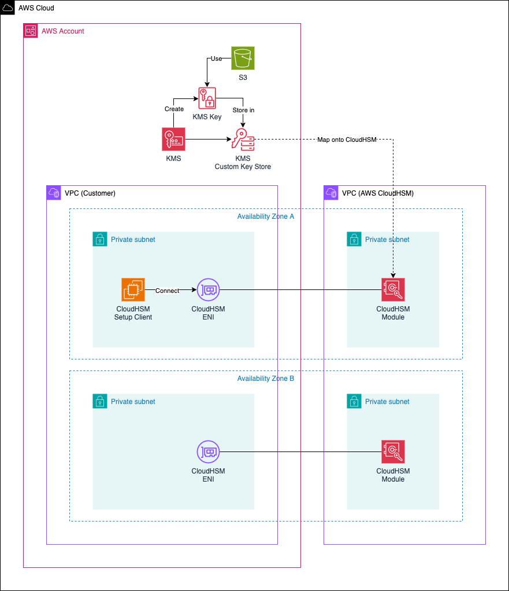

# Setup an AWS KMS custom key store using AWS CloudHSM

This is the repository for the official blog post [Setup an AWS KMS custom key store using AWS CloudHSM](https://www.hendrikhagen.com/blog/kms-custom-key-store/).

# Architecture

To begin, let’s explore the architecture we’ll be deploying in this example. The high-level diagram below provides an overview of the components involved. Our objective is to set up a custom key store in AWS KMS, backed by AWS CloudHSM.

The architecture consists of two main parts: the customer infrastructure, which is managed by the user, and the AWS-managed infrastructure, which is handled by AWS. When you create an HSM, AWS CloudHSM provisions an Elastic Network Interface (ENI) within the specified subnet of your AWS account. This ENI serves as the primary interface for interacting with the HSM. However, the HSM itself resides in a separate AWS-owned VPC, as shown in the diagram under AWS CloudHSM.

On the customer side, we deploy a Virtual Private Cloud (VPC) containing the CloudHSM ENIs (created by AWS CloudHSM) and the CloudHSM Setup Client, which uses the ENIs to connect to CloudHSM and perform activation and initial configuration. Additionally, we set up a KMS Custom Key Store, backed by CloudHSM, allowing us to securely store KMS keys within CloudHSM modules and perform cryptographic operations directly on CloudHSM.

To validate our setup, we will create a simple Amazon S3 bucket at the end of this guide. This bucket will be encrypted using a KMS key stored on CloudHSM, ensuring that all encryption operations are performed securely within our CloudHSM-backed custom key store.

## Try it yourself

### Prerequisites

- [Terraform](https://developer.hashicorp.com/terraform/downloads)
- An AWS Account

### Setup

As this example includes manual configuration steps, please follow the step-by-step instructions of the original [blog post](https://www.hendrikhagen.com/blog/kms-custom-key-store/).

### Teardown

Run `terraform destroy` to remove the infrastructure
