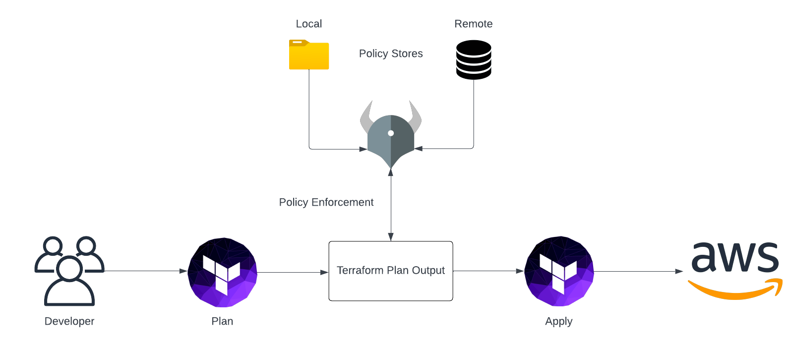

# Open Policy Agent for AWS and Terraform

This is the repository for the official blog post [Open Policy Agent for AWS and Terraform](https://www.hendrikhagen.com/blog/2023-03-17-opa-for-terraform/).

## Workflow

The workflow when using Terraform and Open Policy Agent (OPA) to deploy infrastructure can be divided into four steps.

The first step of the process starts with the developer and the development of Terraform Code itself. Without Terraform code there is nothing OPA could evaluate. After having implemented the desired infrastructure configuration, a Terraform plan output is generated. Afterward, OPA will analyze the plan output and will compare the planned changes to permitted actions defined in custom policy documents. Policy documents can be stored either on the local machine or in a remote location like a database. In case the intended changes comply with the guardrails defined in the policies, the evaluation is marked as successful. A successfully evaluated and compliant Terraform configuration can then be deployed to the cloud.

## Try it yourself

### Prerequisites

- [Terraform](https://developer.hashicorp.com/terraform/downloads)
- [OPA](https://www.openpolicyagent.org/docs/latest/#running-opa) 

### Setup

1. Clone the repo
2. Run `terraform init` to initialize the Terraform environment
3. Run `terraform plan -out tfplan` to generate a binary Terraform output file
3. Run `terraform show -json tfplan > tfplan.json` to convert the binary plan output file into JSON for OPA
5. Run `opa exec --decision terraform/analysis/authz -b policy/ tfplan.json` to evaluate the compliance of the Terraform configuration via the OPA Policy
6. Fix the non-compliant settings and resources and rerun `opa exec --decision terraform/analysis/authz -b policy/ tfplan.json`

### Result

The initial Terraform configuration which is part of this repository is non-compliant. The main goal of this example and the corresponding blog post is to adjust the Terraform configuration to make it compliant. For more information please visit [Open Policy Agent for AWS and Terraform](https://www.hendrikhagen.com/blog/2023-03-17-opa-for-terraform/) for the official blog post.

### Customization

Feel free to use your own Terraform configuration and adjust the OPA policy to your liking. If you want a small challenge, add checks for resource deletions and modifications. Given that OPA is Policy as Code, you can implement any policy you want as long as the attributes and values you are evaluating are part of the Terraform plan JSON file. The possibilities are nearly limitless.

